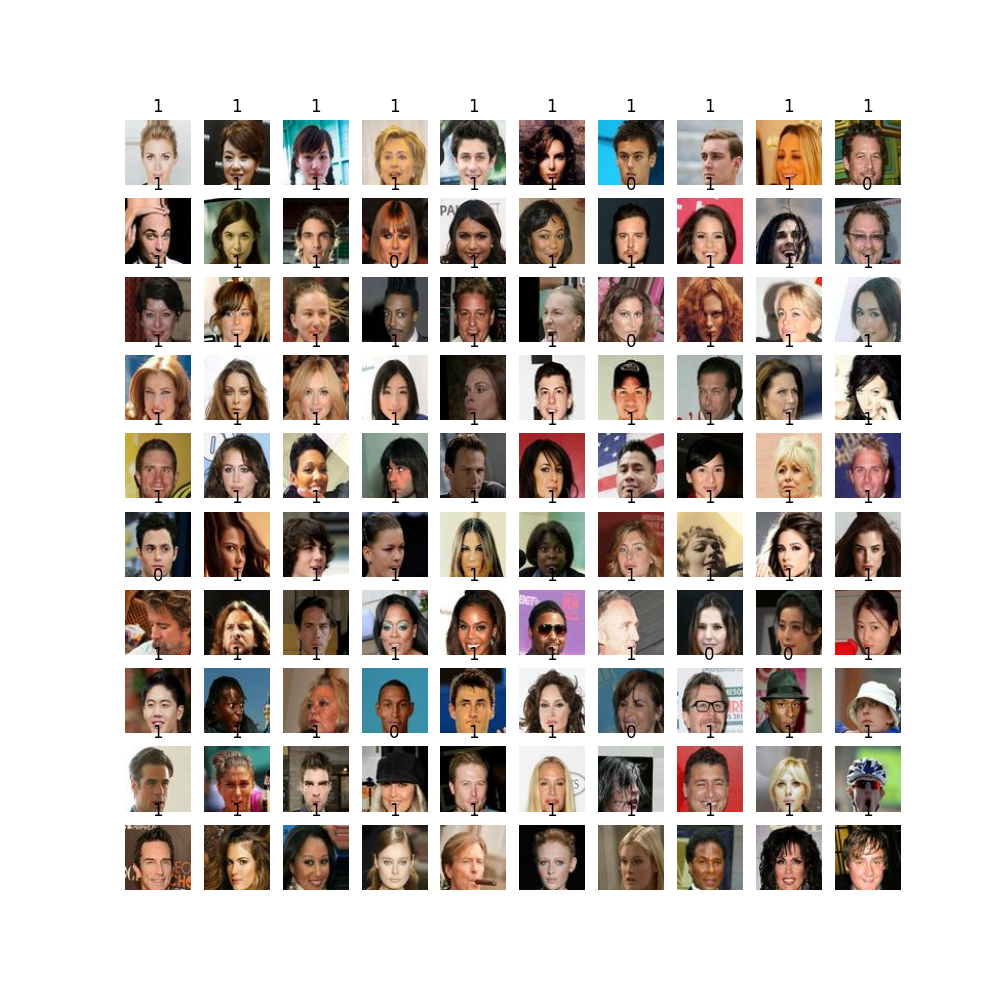
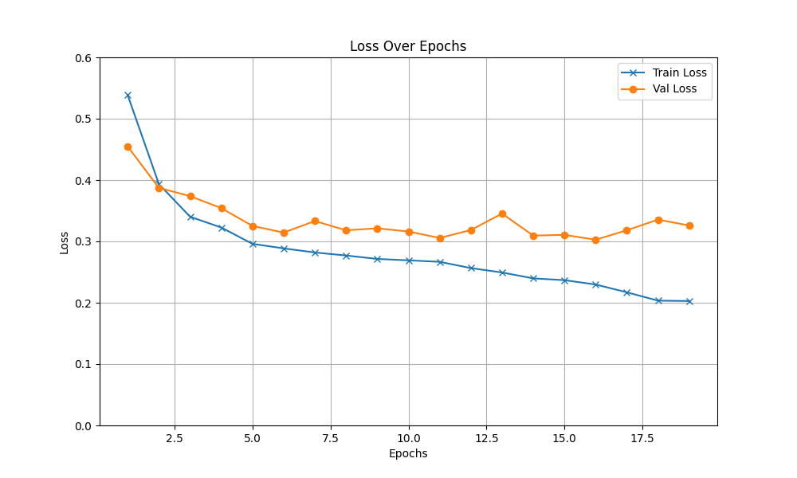
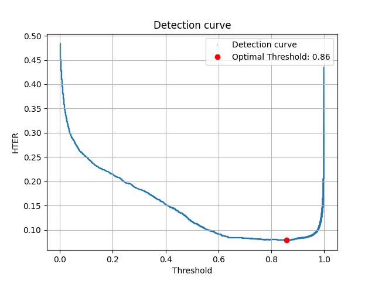

# TheraPanacea Case Study: Binary Classification Problem

## Problem Description
The objective of this case study is to develop a binary classifier that determines whether images contain specific accessories (such as hats, glasses, etc.) based solely on facial features. The goal is to minimize the Half-Total Error Rate (HTER).

### Dataset Overview
- **Training Data**: Contains 100,000 labeled images.
- **Validation Data**: A separate validation set of 20,000 unlabeled images is provided in the `val_imag` folder.
- **Train/Validation Split**: The training dataset is split into 80% for training and 20% for validation.



### Data Distribution
<div align="center">
	
</div>

The dataset is highly imbalanced, with fewer instances of the "0" label compared to the "1" label in both the training and validation sets. To address this, a weighted approach has been applied to train the classifier.

## System Configuration
- **Operating System**: Linux
- **TensorFlow Version**: 2.15
- **CUDA Version**: 12.2
- **cuDNN Version**: 8.9.7

## Training

To set up the environment and start training, run the following commands:

```bash
cd ~
python3 -m venv env
source ~/env/bin/activate
python3 train.py --LR 0.001 --B 16 --E 200 --dense_units 256 --image_size 224 224 3 --base_model VGG16_Based --is_aug_data True
```
`train.py` is written in lower api of tensorflow and variable is self explainatory and weighted cross entropy function is used for loss to try to address the imblanced data. The base model is VGG16 trained weight on `imagenet`

### Loss function 

<div align="center">
	
</div>

Fine tunned vgg based model loss curve

### HTER
**False Acceptance Rate (FAR):**
$$\text{FAR} =  \frac{\text{FP}}{\text{TN} + \text{FP}}$$

**False Rejection Rate (FRR):**

$$\text{FRR} = \frac{\text{FN}}{\text{TP} + \text{FN}}$$

$$\text{HTER}=\frac{\text{FRR}+\text{FAR}}{2}$$

### ROC curve:

<div align="center">
	
</div>


### Detection curve:

<div align="center">
	
</div>


### HTER curve:

<div align="center">
	
</div>

As required in this case, the threshold is based on HTER to minimize it. Thr=0.82

#
