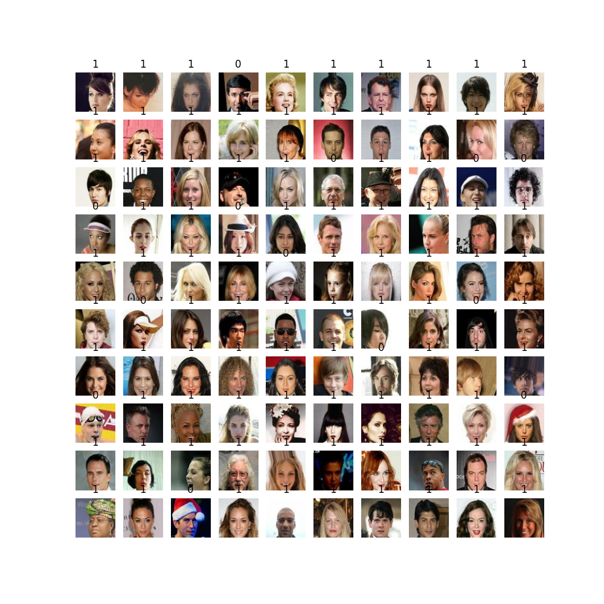

#TheraPanacea_case_study

The problem is to classified without hat/spec... and only face....

With the experience with the image, I am trying to shallow learing for it. Since, based on state of art I moving myself to the directly on CNN. 

system:
Linux
tensorflow 

TensorFlow with cuda with pip
python3 -m pip install tensorflow[and-cuda]
checked the device with: python3 -c "import tensorflow as tf; print(tf.config.list_physical_devices('GPU'))"

source myThera/bin/activate;

